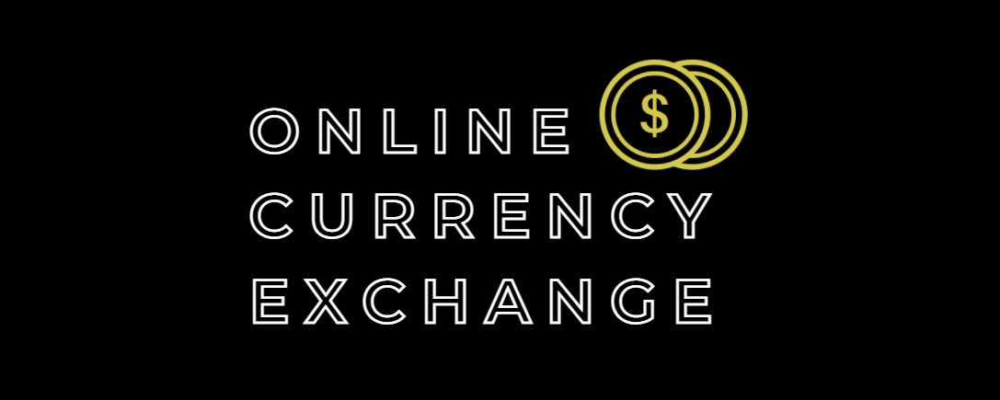

# Currency exchange 

## Table of contents
* [About_The_Project](#About The Project)
* [Technologies](#Technologies)
* [Link to the site](#Link)

## About The Project
The website allows you to check the exchange rate of selected currencies.
It consists of a form in which you should choose the currency you are interested in, the value and the currency you want to buy.

## Technologies
Major frameworks/libraries used to bootstrap this project. 

### Link
[click here to check it out] https://patrycjaslizszpytma.github.io/currency-exchange/

